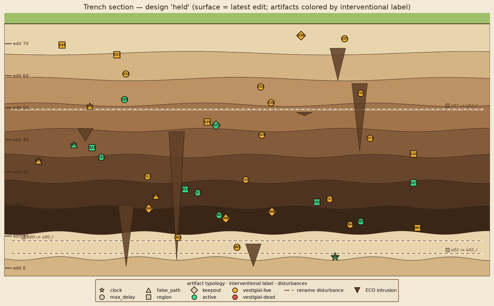
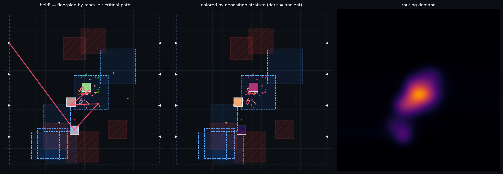
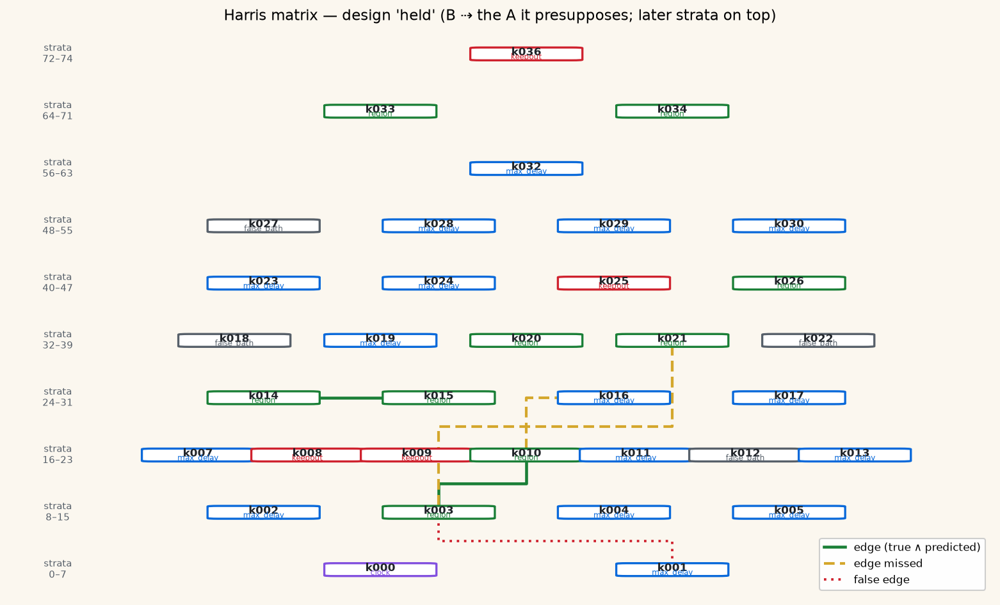
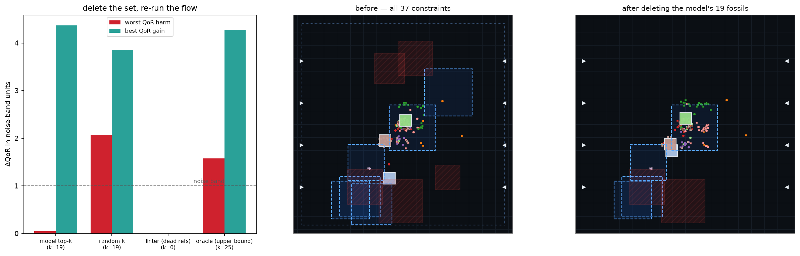

# Design Archaeology 🏺⚡

**Stratigraphic provenance for netlists and floorplans** — detecting *vestigial
constraints* (design rules that no longer cause anything) with methods borrowed from
archaeology: stratigraphy, seriation, and residuality theory.

Everything — the flow engine, the edit grammar, the interventional oracle
(~2,500 place-and-route runs), the models, the deletion experiment, seriation, Harris
matrices, and all figures — runs in **one self-contained notebook**:

> **[`design-archaeology.ipynb`](design-archaeology.ipynb)** — CPU only, no internet,
> ~5–10 minutes. Upload to [Kaggle](https://www.kaggle.com/code) ("New Notebook" →
> File → Import Notebook) or run locally with `numpy scipy scikit-learn matplotlib pillow`.

## The idea

Mature chip designs accumulate sediment: inherited IP blocks, ECO patches on patches,
timing exceptions written for a process node three generations dead. The only way to know
whether a constraint still does anything is *relax it and re-run the flow* — too expensive
to do for hundreds of constraints. Archaeology formalized exactly this problem:

| Archaeology | Chip design |
|---|---|
| Stratum (deposition layer) | A revision / ECO / constraint-file edit |
| Harris matrix (which layers presuppose which) | DAG of which design decisions depend on which |
| Seriation (relative dating from artifact style) | Ordering edits from diff features when history is lost |
| Residual artifact | Vestigial constraint |

The notebook grows synthetic designs through an edit grammar (renames are the fossil
factory), labels every constraint with a real interventional oracle, then trains a cheap
learned surrogate that must beat the dead-referent linter.

## Headline results (held-out design, from a full run)

| task | result | baseline |
|---|---|---|
| vestigiality detection | **AUROC 0.87** (LODO-CV 0.92) | dead-referent linter: 0.50 |
| effect-size calibration | Spearman ρ = 0.88 | — |
| delete the model's 19 fossils at once | **~zero harm (0.05 bands), timing improves 4.4 bands** | random 19: breaks WNS by 2.1 bands |
| seriation (timestamps stripped) | Kendall τ ≈ 0.4, robust to 40% squashed commits | — |
| Harris-edge prediction | AP 0.80 at 0.08 prevalence | — |

87% of vestigial constraints have **live** referents — invisible to any linter.

## The site, as an archaeologist would draw it

*(All images are generated by the notebook; `assets/growth.gif` shows the site
accumulating its strata.)*

## Paper

Target: NeurIPS 2026 workshop (AI4ChipDesign / ML-for-Systems / XAI4Science, 8 pages).
The full paper adds OpenROAD transfer designs, cached code-encoder embeddings, a GNN over
the constraint–object graph, and noise-band ablations — total budget < 10 GPU-hours.
